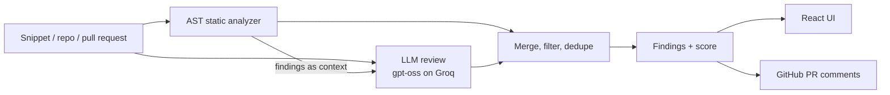

# CodeSense AI

[](https://github.com/HemantAgarwal23/CodeSense/actions/workflows/ci.yml)

AI code reviewer that combines a deterministic **AST static analyzer** with **LLM review** (OpenAI's open-weight gpt-oss models on Groq). Paste a snippet, point it at a GitHub repository, or give it a pull request, and get bugs, fixes, and a quality score. Findings on lines a pull request changed can be posted back to GitHub as inline review comments.

## Features

- **Snippet review:** paste or upload code to see runtime risks, code issues, fixes, and a 0-10 score. Apply a suggested fix to the editor in one click.
- **Repository review:** clones a public GitHub repository and reviews up to `MAX_REPO_FILES` source files concurrently.
- **Pull request review:** reviews only the files a pull request changes, maps findings to the lines its diff touched, and can post them as a GitHub review with inline comments.
- **Measured accuracy:** a labeled benchmark of 40 snippets reports recall and precision for static-only, LLM-only, and combined review.

## How it works



1. **Static analysis** ([static_analysis.py](app/utils/static_analysis.py)) walks the Python AST for syntax errors, runtime risks (division by zero, resource leaks, swallowed exceptions), security issues (SQL injection, `shell=True`, `eval`, hard-coded secrets), and logic smells.
2. **LLM review** ([langchain_client.py](app/llm/langchain_client.py)) sends the code plus the static findings to Groq, parses strict JSON, repairs malformed output with a follow-up prompt, and falls back to a smaller model on errors or rate limits.
3. **Filtering** ([review_service.py](app/services/review_service.py), [findings.py](app/services/findings.py)) drops low-confidence and generic advice, downgrades findings in test files, merges duplicates, and splits results into runtime risks, code issues, fixes, and suggestions.

## Benchmark

| Mode | Recall (bugs found) | Precision (findings that were correct) | Clean snippets flagged |
|---|---|---|---|
| Static analysis only | 27% (8/30) | 80% (8/10) | 1/10 |
| LLM only (gpt-oss-120b) | 97% (29/30) | 88% (35/40) | 3/10 |
| Static + LLM, as served by the API | **100% (30/30)** | 86% (42/49) | 4/10 |

Static analysis is precise but narrow: it catches the patterns it has rules for (literal division by zero, `shell=True`, `eval`, hard-coded secrets, mutable defaults, swallowed exceptions) and misses logic bugs such as off-by-one errors. The LLM finds nearly everything, and the combined pipeline also catches the one bug the LLM missed on this run (a hard-coded API key, which a static rule flags). The cost is false alarms: 4 of 10 clean snippets get at least one finding.

An earlier version of the pipeline reached only 67% recall because its filter dropped LLM findings unless they sounded severe. It now filters on the model's own confidence instead. LLM output varies between runs, and this is a 40-case benchmark written for this project, so treat the numbers as a regression check rather than a general accuracy claim.

Each of the 30 buggy snippets holds exactly one labeled bug (division by zero, SQL injection, mutable default argument, off-by-one, and so on); 10 clean snippets check for false alarms. A finding counts as correct when it is within one line of the bug or, if it has no line number, mentions the bug's keywords. Cases and scoring live in [benchmarks/](benchmarks/), and per-case results are in [benchmarks/results/latest.md](benchmarks/results/latest.md).

```bash
python -m benchmarks.run_benchmark                 # all modes (needs GROQ_API_KEY)
python -m benchmarks.run_benchmark --modes static  # offline
```

## Quick start (Docker)

```bash
cp .env.example .env    # then set GROQ_API_KEY
docker compose up --build
```

UI: http://localhost:5173 · API docs: http://localhost:8000/docs

## Local development

Prerequisites: Python 3.11+, Node.js 18+, Git, and a [Groq API key](https://console.groq.com) (the free tier works).

```bash
# Backend, from the project root
python -m venv .venv
.venv\Scripts\activate            # macOS/Linux: source .venv/bin/activate
pip install -r requirements.txt
copy .env.example .env            # macOS/Linux: cp .env.example .env
# set GROQ_API_KEY in .env
uvicorn app.main:app --reload --port 8000

# Frontend, in a second terminal
cd frontend
npm install
npm run dev
```

On Windows, `scripts\start-backend.bat` and `scripts\start-frontend.bat` start each side after setup.

## Configuration

| Variable | Default | Purpose |
|---|---|---|
| `GROQ_API_KEY` | none | Required for LLM review |
| `GITHUB_TOKEN` | none | Raises GitHub rate limits; required to post pull request comments (fine-grained token with "Pull requests: Read and write") |
| `CORS_ORIGINS` | `http://localhost:5173,http://127.0.0.1:5173` | Browser origins allowed to call the API |
| `MAX_REPO_FILES` | `50` | Most files reviewed per repository or pull request (one LLM call each) |
| `MAX_CODE_CHARS` | `100000` | Largest snippet accepted |
| `LLM_MODEL` / `LLM_FALLBACK_MODEL` | `openai/gpt-oss-120b` / `openai/gpt-oss-20b` | Groq models |
| `LLM_MAX_CONCURRENCY` | `2` | Files reviewed in parallel; higher values hit Groq free-tier rate limits sooner |

The frontend reads `VITE_API_BASE_URL` (default `http://127.0.0.1:8000`).

## API

| Method | Endpoint | Body |
|---|---|---|
| `GET` | `/api/v1/health` | none |
| `POST` | `/api/v1/review` | `{"code": "..."}` or `{"repo_url": "https://github.com/owner/repo", "branch": "main", "max_files": 20}` |
| `POST` | `/api/v1/review/pr` | `{"pr_url": "https://github.com/owner/repo/pull/123", "max_files": 20, "post_comments": false}` |

Responses include `findings` (`runtime_risks`, `code_issues`, `fixes`, `suggestions`), raw per-file results, and `summary.final_score`. Pull request reviews add `pull_request` details and `review_comments` (the findings on changed lines). Errors look like `{"detail": {"error": {"code": "...", "message": "..."}}}`.

## Deploy

[render.yaml](render.yaml) defines the API (Docker) and the frontend (static site) for [Render](https://render.com):

1. In Render, choose **New > Blueprint** and select this repository.
2. Set `GROQ_API_KEY` on `codesense-ai-api`. Leave `GITHUB_TOKEN` empty on a public deployment: the server posts pull request comments with that token, so any visitor could post reviews through your GitHub account.
3. Once both services are live, set `CORS_ORIGINS` on the API to the frontend URL and `VITE_API_BASE_URL` on the frontend to the API URL, then redeploy the frontend.

Free Render instances sleep when idle, so the first request after a pause is slow.

## Tests and CI

```bash
ruff check app tests benchmarks
pytest
```

GitHub Actions ([ci.yml](.github/workflows/ci.yml)) runs lint, tests, and the offline benchmark, builds the frontend, and builds both Docker images on every push and pull request.

## Project structure

```
app/
  api/v1/routes/   FastAPI endpoints (review, pull request review, health)
  core/            Settings and logging
  llm/             Groq + LangChain client (prompting, JSON repair, model fallback)
  services/        Review orchestration and findings filtering
  utils/           Static analyzer, repository cloning, GitHub pull request client
benchmarks/        Labeled cases and the precision/recall runner
frontend/src/      React + Tailwind UI
tests/             API, static analysis, findings, pull request, and security tests
```

## Limitations

- Static analysis parses Python only; JavaScript, TypeScript, Java, and C++ files get LLM review alone.
- LLM output varies between runs, so `llm` and `hybrid` benchmark numbers shift slightly from run to run.
- Repository review needs Git installed and a public repository (or a token with access).
- Groq's free tier allows 8,000 tokens per minute and 200,000 tokens per day per model (roughly two to four files a minute), so repository and pull request reviews of more than a few files take minutes, and a full benchmark run uses a large share of the daily budget. Keep `max_files` small or use a paid Groq tier.
- The LLM sees the first 10,000 characters of each file (static analysis still reads the whole file) so each request fits the free-tier token limit.

## Tech stack

**Backend:** FastAPI, Pydantic, LangChain, Groq, GitPython, httpx · **Frontend:** React, Vite, Tailwind CSS, Axios · **Tooling:** pytest, Ruff, Docker, GitHub Actions, Render
